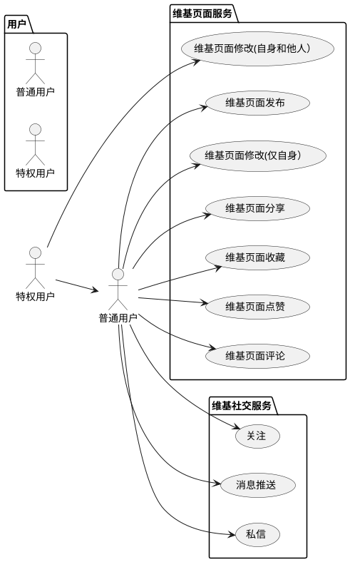
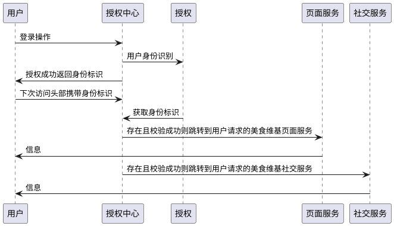

# Food Wiki For Android 

## 需求分析

1)提供用户账户服务，包括账号注册、登录、授权；

2)用户类型分为普通用户和特权用户。普通用户仅可发布、分享、编辑修改自己的美食Wiki页面；特权用户在普通用户的基础上，可以编辑修改他人的美食Wiki页面；

3)普通用户和特权用户均可对自己感兴趣的美食Wiki页面进行收藏、点赞、评论操作；

4)对于喜爱的美食博主还可以添加关注和消息推送，方便第一时间了解其下美食Wiki页面的内容变更，以及收到新发布的美食Wiki页面推送。

5）提供私信功能，方便用户进行非实时交流，符合现代碎片化的生活节奏。

## 系统结构图


## 业务流程图


## 用例图和时序图


### 用例图

[使用代码绘制用例图](http://www.plantuml.com/plantuml/uml/)




### 时序图

[使用代码绘制时序图](http://www.plantuml.com/plantuml/uml/)




## 数据库设计

### 概念模型（E-R图）


### 逻辑模型

### 物理模型


```sql
create table tb_user(id integer primary key autoincrement,username varchar(50),password varchar(50));

create table tb_file(id integer primary key autoincrement,name varchar(50),extension varchar(20),bin blob,path varchar(100),descripiton varchar(200));

create table tb_userinfo (id integer primary key autoincrement,userid integer,figureid integer,name varchar(50),follows int,followers int,readers int,remark varchar(200),foreign key(userid) references tb_user(id),foreign key(figureid) references tb_file(id));

create table tb_food(id integer primary key autoincrement,fileid integer,title varchar(50),contentdetails varchar(1000),selfcomment varchar(300),phonenumber varchar(50),likes integer,stars integer,shares integer,reads integer,foreign key(fileid) references tb_file(id));
```


### 命令行查看SQLiteDatabase

```powershell
/*输入 adb shell 进入设备控制台*
PS C:\Users\Jocoboy> adb shell

generic_x86:/ $ su
generic_x86:/ #

/*使用 cd 命令进入到数据库存放目录下*/
generic_x86:/ # cd /data/data/com.zstu.foodwiki/databases/
/*使用 ls 命令查看该目录里的文件*
generic_x86:/data/data/com.zstu.foodwiki/databases # ls

ThrowalbeLog.db         elp_msg.db         loggerdb         tb_user
/*db-journal是为了让数据库能够支持事务而产生的临时日志文件*/
ThrowalbeLog.db-journal elp_msg.db-journal loggerdb-journal tb_user-journal

/*借助 sqlite 命令打开数据库，输入sqlite3加数据库名即可*/
generic_x86:/data/data/com.zstu.foodwiki/databases # sqlite3 tb_user

SQLite version 3.22.0 2018-12-19 01:30:22
Enter ".help" for usage hints.

/*输入 .table 命令，查看数据库中的表*/
sqlite> .table
android_metadata  tb_user

/*输入 .schema 命令查看建表语句*/
sqlite> .schema
CREATE TABLE android_metadata (locale TEXT);
CREATE TABLE tb_user(id int,username varchar(50),password varchar(50));

/*输入 sql 语句查询表中数据*/
sqlite> select * from tb_user;
0|123@qq.com|123456

/*输入 sql 语句删除表中某一行*/
sqlite> delete from tb_user where id="1";

/*输入 sql 语句删除表*/
sqlite> drop table tb_user;
```

## 核心类的设计和关系


## 界面设计

### 注册界面


### 登录界面


### 美食维基页面

