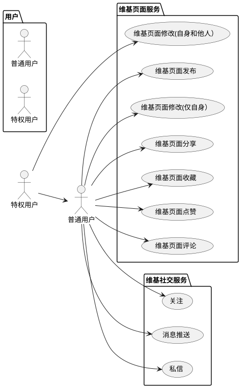
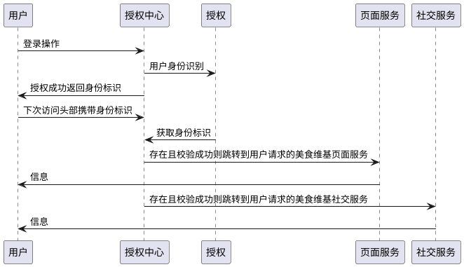

# Food Wiki For Android 

## 需求分析

1)提供用户账户服务，包括账号注册、登录、授权；

2)用户类型分为普通用户和特权用户。普通用户仅可发布、分享、编辑修改自己的美食Wiki页面；特权用户在普通用户的基础上，可以编辑修改他人的美食Wiki页面；

3)普通用户和特权用户均可对自己感兴趣的美食Wiki页面进行收藏、点赞、评论操作；

4)对于喜爱的美食博主还可以添加关注和消息推送，方便第一时间了解其下美食Wiki页面的内容变更，以及收到新发布的美食Wiki页面推送。

5）提供私信功能，方便用户进行非实时交流，符合现代碎片化的生活节奏。

## 系统结构图


## 业务流程图


## 用例图和时序图


### 用例图

[使用代码绘制用例图](http://www.plantuml.com/plantuml/uml/)




### 时序图

[使用代码绘制时序图](http://www.plantuml.com/plantuml/uml/)




## 数据库设计

### 概念模型（E-R图）


### 逻辑模型

### 物理模型


#### Structure

```sql
create table tb_user(id integer primary key autoincrement,username varchar(50),password varchar(50));

create table tb_file(id integer primary key autoincrement,name varchar(50),extension varchar(20),bin blob,path varchar(100),descripiton varchar(200));

create table tb_userinfo (id integer primary key autoincrement,userid integer,figureid integer,name varchar(50),follows int,followers int,readers int,remark varchar(200),foreign key(userid) references tb_user(id),foreign key(figureid) references tb_file(id));

create table tb_food(id integer primary key autoincrement,userid integer,fileid integer,title varchar(50),contentdetails varchar(1000),selfcomment varchar(300),phonenumber varchar(50),likes integer,stars integer,shares integer,reads integer,foreign key(userid) references tb_user(id),foreign key(fileid) references tb_file(id));

create table tb_foodlike(id integer primary key autoincrement,userid integer,foodid integer,foreign key(userid) references tb_user(id),foreign key(foodid) references tb_food(id));

create table tb_foodstar(id integer primary key autoincrement,userid integer,foodid integer,foreign key(userid) references tb_user(id),foreign key(foodid) references tb_food(id));

create table tb_userfollow(id integer primary key autoincrement,userid integer,followid integer,iscancelfollow boolean,foreign key(userid) references tb_user(id),foreign key(followid) references tb_user(id));

create table tb_comment(id integer primary key autoincrement,userid integer,foodid integer,tageruserid integer,comment varchar(500),dt datetime,foreign key(userid) references tb_user(id),foreign key(tageruserid) references tb_user(id),foreign key(foodid) references tb_food(id));
```

#### Data

```sql
/****tb_user*****/
insert into tb_user(id,username,password) values(1,'123@qq.com','123');
insert into tb_user(id,username,password) values(2,'jocoboy@outlook.com','jocoboy');
insert into tb_user(id,username,password) values(3,'2959@sina.cn','2959');
insert into tb_user(id,username,password) values(4,'12315@weixin.xyz','12315');

/****tb_file*****/
insert into tb_file(id,name,extension,descripiton)
values(1,'默认头像','png','用户尚未上传个人头像，使用默认头像');
insert into tb_file(id,name,extension,descripiton)
values(2,'默认封面','png','用户尚未上传美食封面，使用默认封面');
insert into tb_file(id,name,extension,descripiton)
values(3,'纽西兰羊排','jpg','用户上传美食封面之一');
insert into tb_file(id,name,extension,descripiton)
values(4,'果木烤澳洲谷饲牛扒','jpg','用户上传美食封面之一');
insert into tb_file(id,name,extension,descripiton)
values(5,'海鲜烩番茄意大利面','jpg','用户上传美食封面之一');
insert into tb_file(id,name,extension,descripiton)
values(6,'西班牙天然原味肠','jpg','用户上传美食封面之一');
insert into tb_file(id,name,extension,descripiton)
values(7,'西班牙海鲜饭','jpg','用户上传美食封面之一');
insert into tb_file(id,name,extension,descripiton)
values(8,'个人头像1','jpg','用户上传美个人头像之一');
insert into tb_file(id,name,extension,descripiton)
values(9,'个人头像2','jpg','用户上传美个人头像之一');
insert into tb_file(id,name,extension,descripiton)
values(10,'个人头像3','jpg','用户上传美个人头像之一');
insert into tb_file(id,name,extension,descripiton)
values(11,'个人头像4','jpg','用户上传美个人头像之一');

/****tb_userinfo*****/
insert into tb_userinfo(id,userid,figureid,name,follows,followers,readers,remark)
values(1,1,8,'草莓派qs',0,0,0,'这家伙很懒，什么都没写~');
insert into tb_userinfo(id,userid,figureid,name,follows,followers,readers,remark)
values(2,2,9,'鸡腿ovo',0,0,0,'这家伙很懒，什么都没写~');
insert into tb_userinfo(id,userid,figureid,name,follows,followers,readers,remark)
values(3,3,10,'冰激凌dw',0,0,0,'这家伙很懒，什么都没写~');
insert into tb_userinfo(id,userid,figureid,name,follows,followers,readers,remark)
values(4,4,11,'包子os',0,0,0,'这家伙很懒，什么都没写~');

/****tb_food*****/
insert into tb_food(id,userid,fileid,title,contentdetails,selfcomment,phonenumber,likes,stars,shares,reads)
values(1,1,3,'纽西兰羊排','中国北方俗称的新西兰羊排（英文FLAPS)是带骨羊后胸部分-第5根肋骨至第12根肋骨和羊腩-第13根肋骨至后退根部的总称。在新西兰屠宰加工厂，带骨羊后胸部分和羊腩一般是整块分割下来，也有的是分开切割的。所以就有了俗称的整片羊排和断排。根据绵羊是否长出切齿，有羔羊（LAMB)的大羊(MUTTON)之分，有时中间又分出一档，称之为青年羊。羔羊年龄一般在12个月以下，无切齿，肉无膻味；青年羊在1-2年，2-4个切齿，味略膻；大羊为1年或2年以上，味膻。','新西兰盛产牛羊肉，且肉质鲜美，本身鲜嫩入味，加上配菜酱汁的装点，这果木烤羊排，绝对不容错过！','+86 15348850154',0,0,0,0);
insert into tb_food(id,userid,fileid,title,contentdetails,selfcomment,phonenumber,likes,stars,shares,reads)
values(2,1,4,'果木烤澳洲谷饲牛扒','澳洲谷饲牛肉，是指以谷物饲养至少一百天的肉牛。营养均衡且高能量的谷物饲料，通常包括大麦、小麦、燕麦、高粱、玉米等。谷饲牛养成期相对较短，肉质柔软，脂肪量较高，口感更加细嫩美味，在全球都饱负盛名。','这家店才开一个月,果木烤澳洲雪花牛扒就狂卖3000+份!每周进口的澳洲谷饲牛扒,荔枝木现点现烤。作为食肉兽,我已经无法冷静面对它了...','+86 14765690125',0,0,0,0);
insert into tb_food(id,userid,fileid,title,contentdetails,selfcomment,phonenumber,likes,stars,shares,reads)
values(3,2,5,'海鲜烩番茄意大利面','意大利本身就是一个以美食著称的国家，而意面和披萨堪称意大利美食的标志，意粉煮的软韧，酱汁酸甜度刚好，广受各国人民的喜爱。','前阵子去西餐厅点了一份意大利面，花了58块，虽然贵但是味道还不错，回家后还意犹未尽!','+86 18765623105',0,0,0,0);
insert into tb_food(id,userid,fileid,title,contentdetails,selfcomment,phonenumber,likes,stars,shares,reads)
values(4,3,6,'西班牙天然原味肠','西班牙人在吃一些风干切片的香肠时,会把外面那一层肠衣撕下来。咱们国内那么多风肠熏肠腊肠,煮熟切片吃的时候,从来没有剥皮的习惯。','西班牙原味肠蘸着初榨橄榄油送入口中，有种舌尖烟花绽放的快感。入口滋味甘甜诱人，细腻的油脂像雪花一般融化在舌头上，满口回香，令人难忘。','+86 17359805562',0,0,0,0);
insert into tb_food(id,userid,fileid,title,contentdetails,selfcomment,phonenumber,likes,stars,shares,reads)
values(5,4,7,'西班牙海鲜饭','西班牙海鲜饭（Paella，音译为巴埃加），西餐三大名菜之一，与法国蜗牛、意大利面齐名。西班牙海鲜饭源于西班牙鱼米之都——瓦伦西亚，是以西班牙产艮米为原料的一种饭类食品。西班牙海鲜饭卖相绝佳，黄澄澄的饭粒出自名贵的香料藏红花，饭中点缀着无数虾子、螃蟹、黑蚬、蛤、牡蛎、鱿鱼……热气腾腾，令人垂涎。','作为西班牙菜肴中的惊叹号，西班牙海鲜饭连锅上桌后浓郁扑鼻的撩人海洋香气，黄澄澄吸够了高汤精华的米粒，以及五颜六色点缀米饭中的多样食材，总能叫人感官骚动，味蕾大开。','+86 16577851001',0,0,0,0);

/****tb_foodlike*****/
insert into tb_foodlike(id,userid,foodid) values(1,1,2);
insert into tb_foodlike(id,userid,foodid) values(2,1,3);
insert into tb_foodlike(id,userid,foodid) values(3,1,4);


/****tb_foodstar*****/
insert into tb_foodstar(id,userid,foodid) values(1,1,1);
insert into tb_foodstar(id,userid,foodid) values(2,1,5);

/****tb_userfollow*****/
insert into tb_userfollow(id,userid,followid,iscancelfollow) values(1,1,2,false);
insert into tb_userfollow(id,userid,followid,iscancelfollow) values(2,1,3,false);
insert into tb_userfollow(id,userid,followid,iscancelfollow) values(3,1,4,false);


/****tb_comment*****/
insert into tb_comment(id,userid,foodid,tageruserid,comment,dt) values(1,2,1,1,"这是我吃过最好吃的纽西兰羊排！","2021-7-1 18:30");
insert into tb_comment(id,userid,foodid,tageruserid,comment,dt) values(2,3,1,1,"纽西兰羊排单人份，够吃吗？","2021-7-9 12:05");
insert into tb_comment(id,userid,foodid,tageruserid,comment,dt) values(3,4,2,1,"果木烤澳洲谷饲牛扒仅此一家哦~","2021-7-12 22:05");
```


### 命令行查看SQLiteDatabase

```powershell
/*输入 adb shell 进入设备控制台*
PS C:\Users\Jocoboy> adb shell

generic_x86:/ $ su
generic_x86:/ #

/*使用 cd 命令进入到数据库存放目录下*/
generic_x86:/ # cd /data/data/com.zstu.foodwiki/databases/
/*使用 ls 命令查看该目录里的文件*
generic_x86:/data/data/com.zstu.foodwiki/databases # ls

ThrowalbeLog.db         elp_msg.db         loggerdb         tb_user
/*db-journal是为了让数据库能够支持事务而产生的临时日志文件*/
ThrowalbeLog.db-journal elp_msg.db-journal loggerdb-journal tb_user-journal

/*借助 sqlite 命令打开数据库，输入sqlite3加数据库名即可*/
generic_x86:/data/data/com.zstu.foodwiki/databases # sqlite3 tb_user

SQLite version 3.22.0 2018-12-19 01:30:22
Enter ".help" for usage hints.

/*输入 .table 命令，查看数据库中的表*/
sqlite> .table
android_metadata  tb_user

/*输入 .schema 命令查看建表语句*/
sqlite> .schema
CREATE TABLE android_metadata (locale TEXT);
CREATE TABLE tb_user(id int,username varchar(50),password varchar(50));

/*输入 sql 语句查询表中数据*/
sqlite> select * from tb_user;
0|123@qq.com|123456

/*输入 sql 语句删除表中某一行*/
sqlite> delete from tb_user where id="1";

/*输入 sql 语句删除表*/
sqlite> drop table tb_user;
```

## 核心类的设计和关系()


## 界面设计

### 注册界面


### 登录界面


#### 个人信息设置页面


### 美食维基核心页面

#### 发布页面


#### 首页


#### 我的关注


#### 我的收藏


#### 我的点赞


#### 回复我的

